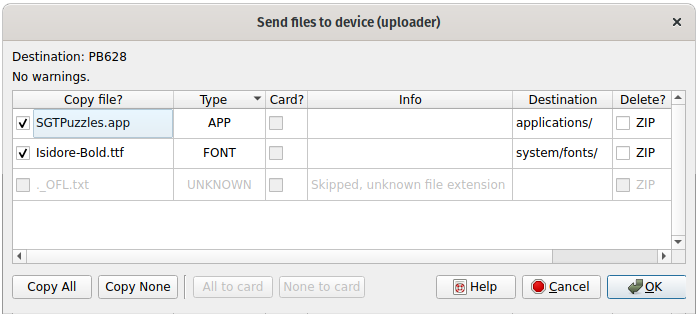
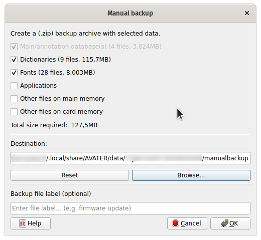
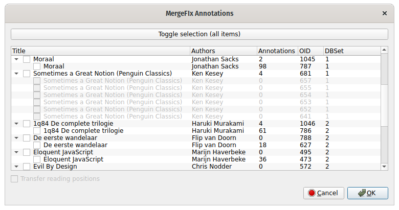
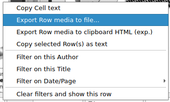
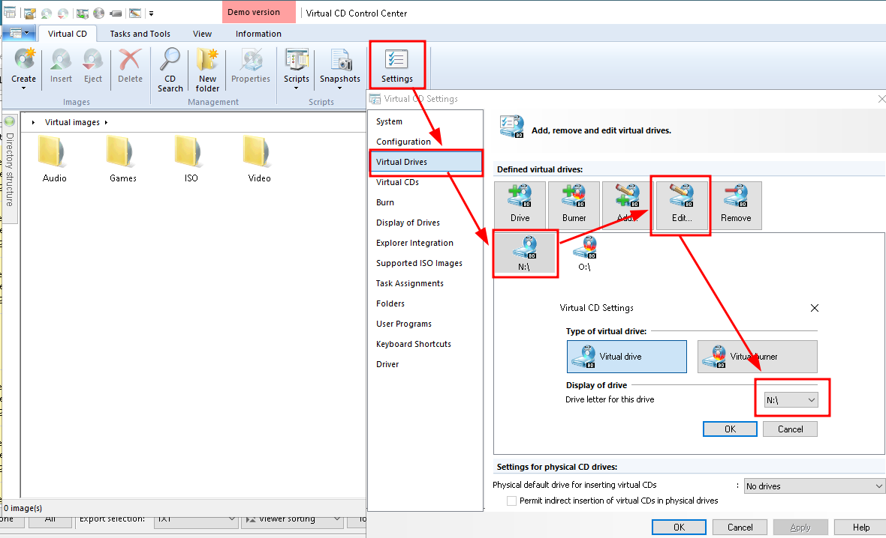

[Version 0.13.0]

Interactive annotation viewer/exporter for **PocketBook e-readers**, with additional tools.


We do:

+  **interactive annotations reading, searching and exporting**  directly from the e-reader
+  **store annotations locally** for viewing after disconnecting
+  provide basic **tools** for e-readers
+  **backup** device databases and other files 

We don't:

+  manage device content or an e-book library
+  modify e-book files

Some highlights

+  **auto-detect e-reader (dis)connection**
+  cross-platform: Windows and Linux. (Apple is planned)
+  device settings/annotation files can be easily copied/synced.


## Requirements

### Supported E-Reader devices
- PocketBook e-readers, with recent 6.x firmware, and late 5.x firmware (please report any compatibility issues)
- Vivlio e-readers (rebranded PocketBook e-readers)

### Windows
+ Windows 10/11 (64-bit Intel/AMD compatible only currently)
+ Version 0.13.x and older support Windows 7,8. If you need a working version, please contact us.

### Linux
+  requires udev (kernel support), Qt5, LibZip libraries
+  typical <100MB memory


### Performance notes
- Loading annotations **directly** from a device takes longer due to their slower storage mediums: the 'local mirror' feature improves this. See also [performance improvements](#improvePerformance).

- performance is expected to be good to acceptable even on older hardware. Some optimizations are available under "Settings > Annotation Viewer".


<a name="configurationfiles"></a>

## Configuration files

- A. **generic settings file**: (avater.conf) UI related, considered to be 'local' to the device; stored in system config dir;
- B. **device settings file** (devices.conf): device related information, stored in data directory;
- C. **data directory**: directory with *device settings*, backup and *locally mirrored DB* files.

The data directory [C] may be synced across devices. The *generic settings* [A] are then configured locally, but this can be overridden using the CLI. However, these settings are few and easily reproduced.


### Configuration file precedence / overrides
Option (4) is the default situation. Any earlier condition takes precedence / overrides the default.

	1. Portable mode (See below and "CLI Options")
	2. CLI provided locations
	3. GUI configured data location (settings dialog)
	4. Default locations (Qt derived) if not provided by (2) and (3)

### Portable mode
Stores all settings and files in the application directory '\<APP_DIR\>': 

	- avater.conf: <APPDIR>/avater.conf
	- data: <APPDIR>/data/
	- devices.conf: <APP_DIR>/data/devices.conf


## CLI Options

<!-- Keep h5 to avoid TOC inclusion -->

##### - - help

Show available options.

##### - p / - - portable

Run application in portable mode.

_Note: To convert a default 'data' directory for use with portable: copy/move it into the application directory. See also Settings and files_.

##### - - settingsdir <DIRECTORY>

Overrides the location of the _generic_ avater.conf file.

##### - - datadir <DIRECTORY>

Overrides the location of *both* the default/user-set data directory, and the therein stored devices.conf file.

##### - - debug

Enable debug logging to stdout. 

_Note: CLI debug settings take precedence over preference debug settings (see "settings > advanced")._

##### - - debuglogfile (0.9.9+)

Enable debug logging to the provided file. A text file will be created if necessary (write permission is not checked, and will fail silently). The log is accessible from the GUI help/debug menu.

_Note: CLI debug settings take precedence over preference debug settings (see "settings > advanced")._

##### Notes

- relative paths are converted to absolute
- both forward/backward slashes are accepted
- data directory and it's content will be created *when* necessitated by user action.


## Main menu


### Main

<a name="scandevices"></a>

##### Rescan devices (F5)
Scans system for new or removed devices. This includes:

- USB devices
- Local DB mirrors

Both USB devices, and local mirrors (0.9.8+) are removed if not found (removed from the program, not unmounted - for local mirrors no files are removed).

##### Eject all devices
Removes all USB devices from the program - *but does not unmount* these from the OS.

<!--
##### Load archived annotations
Allows importing annotations from a backup archive, into a 'virtual' device. *Currently only creates a temporary device.*

The provided name is used as the devicename in the device selector. You may afterwards also set a devicelabel, but it will _not_ be saved.
-->

##### Open datadir path
If created, opens the 'data' directory using the OS' file browser. See [configuration files](#configurationfiles). Note: this directory is created when needed. 

##### Check for updates (optional)
Manually check for a new program version. If an update is found, a prompt offers the choice of visiting the download page. Alternatively, you may enable/disable the automatic update check under settings.

##### Settings
Opens the settings dialog. Settings are undocumented, but hovering over labels/options will show 'tooltip' pop-ups with information.


### Profiles/Annotation Sources menu (0.10+)

Any found and supported annotation sources (i.e. PB profiles) are shown here. Selecting one will clear the viewer and will load any of that source its annotations.

### Help menu

Offers various links and the about window, but version information.

### Debug menu (0.9.9+)
If either debug mode is enabled, the debug menu is shown.

#### Log selected row SQL data (0.9.9+, experimental)
For selected annotations, this outputs the 'raw' SQL data to the debug log. This can be used by the developers to solve certain problems.

_Note: The export is currently hardcoded to use the local mirror when mirroring is enabled, else the device's databases._

##### Open debug logfile
Accessible if debug messages are logged to a logfile.

Debug logging can be enabled from the settings menu or the CLI. Consult the FAQ (near the end of this document) for more details.


<a id="devicetoolbar"></a>

## Device Toolbar


### Scan for devices button (optional)
Scans system for new or removed devices. See also [Rescan Devices](#scandevices)

### Eject device button
Removes the device from the program. This does **not unmount** the device.

If the device has a '*local db mirror*', the device entry is kept, is labeled as disconnected, and any device references are purged. Ejecting 'local mirrors' does nothing.

### Device selector
Select one of multiple devices or *locally mirrored (LM) devices*.

##### Device state icon
Mounted devices are displayed in dark grey, unmounted in light grey. Local Mirror entries are indicated by a circle on the left; e-readers by a square on the right, with an optional SD-card symbol in the middle. 

##### Switching and loading annotations

Switching between devices loads the annotations for the selected device (unless disabled under *settings > Annotationsviewer*). Previously loaded annotations are kept in memory until the device is removed from the program (for *local DB mirrors* this will not occur).

##### Custom device label

You may add a custom label using "Device Tools > Set Devicelabel". For example the model type.

### (Device) Tools
Available tools may differ per device and vendor.

***

#### Send files to device
This tool copies system files, such as apps and fonts, to their appropriate folders on the reader memory (or card memory).

It's mainly intended for (partially) restoring backups generated by the program.



##### Currently supports sending the following system/app files:

	- .acsm (adobe digital download file)
	- .app
	- .dic (dictionary)
	- .pbi (dictionary/app)
	- .ttf (font)
	- .otf (font)
	- .ttc (font)
	- .bin (update file)

##### .ZIP support

Files stored in .zip files, such as backup archives, can be processed and -if supported- extracted by the program.

*Note that marking such a file for deletion, will delete the parent archive, not the individual file.*

##### Uploading of eBooks or ACSM downloading?

_Not implemented yet_. ACSM downloading is a planned feature. 

***

#### Manual Backup Device

Creates a common .zip backup archive with selected device content.



Type of files to backup:

- **Databases:**
Copies the (e-book) metadata and annotation database(s). Databases are always archived, to prevent recovery problems at a later date.

- **Apps, Fonts, Dictionaries:**
No special remarks apply.

- **Other files (main/card):**
Back-up any other directories and files on the device, **excluding** a) the previously discussed types and b) the /system/ folder. The program will not remember these being checked to reduce device access. 

*Note: e-Reader transfer speeds average at about 1-2 minutes per GB*

##### Warnings
If a detected main or card device is unmounted when opening the dialog, a warning is shown. You may continue at your own discretion.

If a device is disconnected or unmounted between the moment of opening and clicking "OK", the backup will be canceled. Rescan your devices to detect newly mounted devices.

##### Compression
As e-Books and dictionary files tend to be already (maximally) compressed, these are 'stored' in the .zip archive, saving (processing) time.

##### Backup integrity, testing and long term storage
Ideally the end-user (you) would tests back-ups, which is not practical. The program employs some precautions to ensure correct storage, and will (attempt to) warn on failure.

*Note regarding data integrity: the .zip format's internal checksums can (only) indicate data corruption after storage or transmission. Depending on the value of your data, consider a good backup strategy, and hardware/software integrity features (ECC, ZFS, etc.).*

***

#### Check DB integrity

This tool checks both device and locally mirrored databases (DBs) for errors. It utilizes SQLite's ('official') "integrity_check" feature.

Should any errors be indicated, click on "Show Details" for more information. Warnings regarding so-called 'WAL' files, or "database not found" are harmless; any other errors can indicate serious issues with the database or the device it's (internal) memory.   
Usually such errors are unrecoverable, but you may attempt to recover part or the whole DB using third party recovery tools (SQLite's CLI tool is a free option).

*Note: 'WAL file' related errors may be ignored, and may not persist across checks. Errors relating to opening databases may occur when the device monitor is disabled (by user or a failure to start), and a device was disconnected.*

***

#### Merge/Fix annotations on device
This allows merging of bookmarks/annotations for similar e-books.

After an e-book file is changed on the device, it may be treated as a new book. Examples are modifying metadata, or re-lending/downloading public library e-books. Afterwards, annotations from the previous file may no longer show for the 'new' file. 

Should the two e-books be (nearly) similar, one can transfer annotations between files. To do so, this tool searches for duplicated titles, and (interactively) modifies associated annotations to point to the (highest) ID representing the 'newest' book entry.



In the tool GUI:
- Parent items represent the 'newest' book version, with child items being  older files. 
- The annotations count shows if any annotations can be transferred.
- 'DBSet/ProfileID' refers to the annotation profile (this is usually 1, and can be ignored if so)

If you are sure the child items refer to the same book (see warnings), you may check these titles for merging. Clicking the parent checks all child items. Next, click 'Ok' to apply the merge/fix.

**<span style="background-color:yellow">Warning:</span>** 

- Please **backup your database** file(s) first, for example using the 'Manual backup' menu option.

- The assumption is that the book content was not changed between each version. If it has, transferred annotations may point to the wrong locations, as the tool does not correct for this (yet). 

- The PB database design tends towards adding or duplicating entries instead of modifying them. However, to avoid excessive duplication, this tool modifies data in-place.

***

#### Local DB mirror
Mirrors a device databases locally, for accessing annotations when a device is disconnected. It also provides a speed-up.

If enabled for a device, the local mirror is updated whenever that device connects to the program. Annotations are then reloaded (or do so manually using the Viewer menu option "Reload annotations").

Note: this is a basic local caching solution, that leverages existing device support. A future centralized database is being considered.


##### <span style="background-color:yellow">Warning regarding dual use as 'autobackup'</span>
Beware that a device reset (which resets the device DBs) will be carried over into the local mirror, thus erasing any previously locally stored annotations. Should you want to reset a device, store a manual backup *before* resetting. This backup can be imported to keep access to the annotations.


***

#### Add Devicelabel
The label provided here, will be shown in the device selector.

***

### Load annotations button (optional)
Only visible when auto-loading annotations is disabled (see settings). If your device is slow, this may improve startup time.

## Annotation Viewer

The viewer displays annotation (meta)data in multiple columns. 


##### Column visibility

Can be toggled by right-clicking in the 'header' bar (i.e. with "Title", "Page"). By default, the "Date" and "Authors" columns are hidden.

##### Highlight/note texts

Double clicking on the highlight or notes cell, allows selection and copying of text fragments. *Note: Newlines are currently not shown.*

##### Highlight/note coloring (0.9.8+)

Highlight colors can be shown (since 0.9.8), with an optional color text abbreviation. See [Additional options.](#additionalOptions).

##### Viewer context menu


The viewer context menu (right-click), offers short-cuts for filtering on that row's fields.

- **Copy this cell** copies the pointed to (single) cell's content to the clipboard as raw text. For advanced export features, see the [exporting section](#exporting).

- **Copy selected row(s)**: short-cut for copy to clipboard. Follows the GUI sorting mode; for advanced export features, see the [exporting section](#exporting).

- **Selecting text segments** If wanting to select text segments within a highlight/note, double click that cell to access the text. (Note: rich text formatting is to be implemented)

- **Clear Filters and show this row** Clears all filters, and attempts to move the display to show this row, or the **first** selected one.


### Searching annotation data


Allows interactive searching. Text searches are slightly delayed - this duration can be changed under "settings > Annotation Viewer".

+ "Filter": Filter annotations on date and page
+ "Search author": plain text search
+ "Search title": plain text search
+ "Search highlights/notes": Regular Expression search, of both Highlight and Note texts

##### Case sensitivity
Case sensitivity can be toggled under the Viewer Tools menu (right-most button).

##### Regular Expression support

Currently implemented only for "Search highlights/notes" (but trivial to do so elsewhere). A general grasp of 'common' regular expression syntax will be beneficial. Some examples:

- '.' represents any character or whitespace, i.e. ".and" will match "land" and "band", but also " and". 
- Brackets allow either/or matching, i.e. "[l|b]and" matches both "land" OR "band".
- '|' represents an OR condition , i.e. "work|play" finds all entries with either "work" or "play" in them.

*Note: This is still a basic feature. If you have a specific use-case, feel free to inform the authors.*

<a id="sortmodes"></a>

### Sorting annotations
The following sorting modes are available:

+  sort by date (newest below)
+  sort by title and date (newest below)
+  sort by title and page/offset
+  custom sorting (clicking the table header)

*Note: Custom sorting is partially implemented, and does not persist across restarts.*

Case sensitivity can be toggled under the Annotation Viewer menu.   
Lastly, sorting of exported annotations can be [configured separately](#exportsortmodes).

<a id="additionalOptions"></a>

### Additional options

Accessible via the right-most tools button.

- **Show notes inline:**
'Inlines' the note texts into the highlight column, hiding the note column.

- **Show Bookmarks:**
Show or hide bookmarks in the viewer. These are hidden by default. 
\
*Note: If selected, hiding them using option removes their selection status.*

- **Show Deleted annotations (0.10+):**
Show or hide deleted annotations in the viewer: if enabled, deleted annotation rows will be shown slightly faded and have a "D" mark in the delete column. Note that deleted annotations may include modified annotations (their previous version).
\
*Note: If selected, hiding them using option removes their selection status.*

- **Row color mode**
Sets the highlight color mode. Options include full row coloring (default), the 'color column' or disabled. __Note: May require scrolling to update the view__

- **Toggle color text:**
Shows or hides a text abbreviation of the highlight color, for use in bad light conditions, UI 'nightlight' modes or for visually impaired users. __Note: Scrolling may be needed to update the view.__

- **Resize Rows:**
Recomputes the row heights to show (nearly) all text. Should only be needed after resizing columns. Note: running this once, makes the auto-resize obsolete, until a (search) filter is applied.

- **Reload Annotations:**
Reloads only the (annotation) data, and prompts the viewer to update. *Normally not needed.*

- **Reset Viewer:**
Resets both the viewer model, and reloads annotations. *Normally not needed.*

<a id="exporting"></a>

### Exporting annotations


Selected annotations can be exported to file or the clipboard, using the buttons "To File..." or "To Clipboard" (in the bottom export toolbar). A short-cut is available via the context-menu (right-click on a viewer annotation row).

- **Export format**

	- TXT: Plain text
	- HTML: HTML format
	- CSV: CSV-format matrix table. Field separator can be changed under Settings > Annotation Viewer.
	- Markdown: MD-format matrix tables. Experimental, read also "Known issues".

<a id="exportsortmodes"></a>

- **Export sorting mode**
By default, exports use the GUI sorting order. This can be overridden by selecting a [sorting mode](#sortmodes) in the bottom export toolbar.

- **Export to "Clipboard"**
Copies selected annotation data to the clipboard.

- **Export "to file..."**
Opens a file dialog for selecting an _export file_, and exports selected annotations to that file.

_Notes, PocketBooks: Highlights edited on PB devices using that device's Notes app, may lose their page and highlight location data._


## Other Topics

### Known Issues

#### Missing page numbers
Annotations from older PocketBook firmware versions, may miss page number information. The page column will then show "?". Alternatives are being considered.

#### Reader disconnection during running/pending operations
Disconnection will not (yet) cancel running operations: generally some warning will be shown; file transfers and DB access tend to fail gracefully.

#### Connecting many readers at once
Connecting multiple (supported) readers at once is still untested. Windows versions prior to 0.9.8. performed a full device scan upon detecting USB changes, and should be avoided in this case. 

If you can help test this, please contact the author(s). For extra safety, first disable "loading annotations" (under settings), *restart* the program, and then try (this avoids database access).

<a id="improvePerformance"></a>

#### Improving program performance
With v0.9.7, program speed was improved markedly. If hard-pressed, these changes may improve the situation:

- Ensure the last (right-most) column is not stretched. If it is, right-click in the annotation viewer header, and select "reset columns".
- increase the search delay to 1000ms or more (reduces interim searches)
- disable case-sensitive sorting (faster method)
- prefer "sort on date" (default annotation order)
- keep bookmarks hidden (reduces annotation count)
- use a local database mirror (reduces disk access time)
- use a filter preset of 6 months or less (reduces annotation count). The setting is retained between restarts.

#### Markdown export issues (v0.10+)
Given it's general background (i.e. competing Markdown standards, especially w/r to tables; various extensions and Markdown converters), the Markdown export is likely to experience problems down the road. 

Known issues:
- a single dollar sign in the booktitle (rare), may be seen as starting a math formula, breaking the table export. Ghostwriter ignores this, but Apostrophe inserts a <span> tag breaking the table.

#### Linux: no or limited debug messages
First, AVATeR only outputs debug messages when requested to do so from the CLI or GUI settings. Second, many distributions have blocked debug messages from being output, due to excessive default(!) debug messaging by applications. 

If AVATeR debug output is enabled, and it detects the OS has blocked debug messages, it will attempt to restore debug output. Alternatively, on Linux you can issue ```export QT_LOGGING_RULES="*.debug=true;qt.*.debug=false``` from the shell/terminal, to force debug messages to show. See also: https://stackoverflow.com/questions/30583577/qt-qdebug-not-working-with-qconsoleapplication-or-qapplication

#### Windows: VirtualCD USB detection compatibility (0.12.1 and lower)

On Windows, the VirtualCD application (www.virtualcd-online.com) appears to modify drive letter assignment, which conflicts with detection of the drive letter. This situation is being investigated. Note v0.12.1 fixed a bug that made the same local mirror unavailable. v0.13 should show the device as unmounted, with the possible exception of VirtualCD having mounted a device on the same drive location.

A temporary work-around is as follows (this assumes the drives are unused): configure your VirtualCD drive(s) to use drive letter(s) at least two 'steps' higher than the current ones (i.e. E: becomes G:), thereby leaving earlier drive letters available for Windows for mounting your USB e-reader. This settings can be modified as follows:



#### Minor issues

- **Scroll CPU spikes**
Mouse-scrolling annotations can show up in visual CPU monitors as a CPU spike; note however the used CPU time (i.e. duration) is very short.

- **Book metadata on PocketBooks**
For the time being, book metadata is read from the books.db file in order to keep things simple. Note external apps that change metadata may only target the explorer.db, explaining any discrepancies. 

***

### FAQ

#### Reader device is not recognized or shown
### Enabling debug logging
During operation, the program can report its status and any encountered errors at pre-defined points during operation. These messages are typically written to a text file, or 'logged', hence the term 'logfile' (or 'debug' file).

When solving problems (so-called 'debugging'), the logfile is an important diagnostic tool for the developers to find where problems occur. Often 'logging' is disabled by default, to reduce resource usage. Hence, you'll likely first need to enable logging using the program settings. This is quite easy and discussed next.

##### Enabling logging
To enable logging: 
- open the menu option "Main > Settings": here open the last tab "Advanced": next to "Log debug messages", select "Log to file". The filepath shown below the selector is the logfile location. Restart the program to enable logging (as prompted by the pop-up).
- advanced users may enable this from the CLI/shell (consult the "--help" information).

##### Viewing the logfile
After enabling logging to file, and restarting, recent AVATeR versions will show a new "debug" menu. Open it, and select the option "open debug logfile" to view the logfile. Save it to a new place, and send the file to the developers. 


AVATeR expects the OS (or you) to have mounted any supported e-readers, making the files accessible. Otherwise, the program will (silently) ignore the e-reader. (Future versions may indicate unmounted devices.)

Also ensure your device is supported by AVATeR. Newly introduced devices may use a new (USB) vendor ID, which must first be added to the program.

*Note: some Linux distributions will show filesystems, but only mount them upon user (UI) action/access.*

Steps you may try in addition are listed below. If the problem persists, enable debugging, inspect the program logfile and/or contact the author(s).

- (v0.9.8 and older): on slow/older machines, increase the "mountDelay" time under "settings > advanced".
- try reconnecting the device (avoid quick successive re-connection)
- turn the device off (hold power-button) and on
- for Pocketbooks: disable wifi
- try another USB port
- try another USB cable
- restart the computer at least once


#### Columns are compressed or text is invisible
This seems to occurs when saving column-sizes for an empty table; it should normally not occur.

To fix: right-click the annotation viewer header row (with "Author", "Title", etc.) and select "Reset to Default".

In case that fails:

1. Stop the program, or else the 'faulty' entries will get saved again.
2. Locate the avater.conf file (see start of the logfile)
3. Remove any (at least two) lines from avater.conf labeled "table_columnsettings": one below the "[viewer]" line, and the other below the "[uploader]" entry.

#### Persistent crash directly on start-up (<v0.10)
Pre v0.10, a rare crash could be caused when switching between Qt5/6 versions. As of v0.10, column settings for either Qt version are stored separately. For older version, fix this by removing both  "table_columnsettings" entries from the preference file: see the previous FAQ item for this.

#### Is the device data(base) safe?
This program's **read-only functions** should not be able to cause damage. AVATeR doesn't continuously access DBs, importing data instead, at the cost of some memory.

Functions that **modify** the device's DBs do carry an inherent risk: these are the "merge/fix annotations" and "restore reading progress". To minimize risks, consider the following points:

1. Preferably make a DB backup before using these tools (as prompted).

2. Ensure the device and USB cable are undisturbed during operations (with worn out USB ports even a nudge can cause a temporary disconnection). 

Do note the SQLite database (DB) commonly used by (embedded appliances such as) e-readers is a robust DB format, widely used and well tested.

Lastly, AVATeR is not exempt from programming mistakes and/or compatibility problems, such as database changes after firmware updates. Generally, such operations will fail early (and safely), and additional checks are in development. 


***

#### Appendix: PocketBook recovery details

Some topics will come up repeatedly. 

**Note we provide no support for, and assume no responsibility for, trying out the discussed recovery aspects.**

##### Changing configuration files and settings directly

The various PB configuration settings files (.cfg, .dat, etc) cannot directly be modified. The cause is a hash signature, prompting the reader to revert to the backup file.

In case of problems, deletion can be considered (also remove the ".back" copy), but this rarely solves problems.

##### Manual recovery of fonts, dictionaries and apps

Fonts, dictionaries and apps may be restored by loading a backup archive with AVATeR's "Send files" tool.

The backup archives produced by this program are standard .zip archives, so any .zip extraction utility should be able to extract the files. Files are stored in their original (device-relative) paths. These may change however between firmware versions.

##### Manually restoring database files

Restoring database files is risky and should be avoided. However, if devices have identical firmware and e-book file paths, a chance of success exists. Often there is little to lose anyway: at worst the device can be reset again. 

###### Database types
For PocketBooks, the main DBs of interest are: 

- explorer-3.db: e-book metadata
- books.db: bookmark/annotations, with some metadata

###### Caveats

Consider the sources of complications when replacing databases:

- **firmware updates**: may change the database layout between versions. A manufacturer may(!) account for this during access or updates, but cannot always do so.
- **ebook file changes**: these change the file's 'hash', used as a identification help. Upon change, a book file will be perceived as a 'new' book, thus losing it's link to previously associated reading progress and annotation data. 
  
	- Causes of file changes include: replacing the cover or internal (meta)data
	- Some readers use the filename and filelocation to re-identify files, as neither are intrinsic to the file itself (and thus the hash). Changing memory cards (and its card ID) may complicate this
	- Lastly, the filedate(s) are also not intrinsic to the file, but are sometimes used in the hash for (partial) identification.


***

### History/changelog/roadmap

See changelog.txt

Originally this was a set of tools for PB readers. The annotation HTML exporter was made interactive, and made the UI centerpiece.

We aim to provide a basic set of tools, focused on being generic and adaptable to new situations. Content can be best managed by the e-reading device or specialized programs.

The current implementation integrates several components: an underlying reader management layer (using standard library functions, and Qt SQL functions), a Qt based mainwindow, with an integrated annotation viewer, and several tools. Future versions may see these components being split out.

***

### Donation/purchasing
At the moment, you are encouraged to donate if you are able to do so. This may change in future versions, if there are valid reasons (support load, etc.).

***

### Privacy

- **Transmitted data**. During the optional update check, only the **program platform is communicated by means of the URL**. 
	- The updater requests permission for checking on the first program startup.  
	- The update retrieves only a version number; if an update exists, a question dialog will allow you to open the download page in your default webbrowser.

- **Program configuration files and logfiles**
Configuration files may contain a device's serial, once a 'devicelabel' or 'local DB mirror' has been configured. In addition, the serial of the last used device is stored. _Note: the serial can be 'hashed', but this gains little._

- **Program Backup files**
These are stored locally on your device. Largely self-explanatory: depending on the device, the archived files may include references to document title/author(s), genres, highlighted texts and user notes, if any.

***

### Support / Bugs / Feature requests / etc

Please see the website for more information.

***

### Copyright / License
Copyright (C) 2021-2023+ Authors (See "help > about" or authors.txt)

This software is provided 'as-is', without any express or implied warranty. In no event will the authors be held liable for any damages arising from the use of this software.
